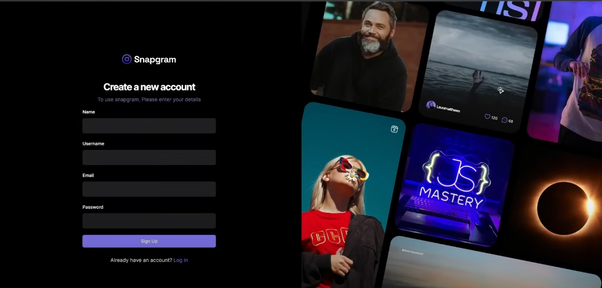

# Welcome! To 👋 Instagram 2.0

  
  

  
 
    
    
    
    
    
  

# My Learning

- Making layout using react-router-dom
- Form using react-hook-form
- Form validation using zod
- appwrite authentication
- appwrite database and storage
- TanStack Query for Mutations and Queries
- State management using context api 
- React-dropzone for file uploading
- Shadcn UI

### Further development

- User fun likes and saves 
- User Profile page
- People Pages 
- Edit Profile of user
- Follow and unfollow
- See others save and likes
- Root layout 
- Explore Page
- Search Post
- Other Sign in options 

### My Progress

-  Signup UI and functionality
-  Login UI and functionality
-  Logout functionality
-  User Details 
-  Create Post UI and functionality
-  Post UI 
-  update post 
-  Save of post 
-  Form component , edit component, invalidating on edit post, updatePost Api function
- deletePost, post details, 
- Saved page ( show save of current user )
- Home page

### TODO's: 

  - TODO: Explore Page
  - TODO: Search Post
  - TODO: People Page
  - TODO: User Profile
  - TODO: Follow
  - TODO: Edit Profile
  - TODO: Verify emails
  - TODO: Other Auth
  - TODO: Responsive and UX

# Acknowledgements 
- [JavaScript Mastery]('https://youtu.be/_W3R2VwRyF4?si=4WSsg16rxEsbIUV-')

# Feedback for me

# Useful Resources

# Course

## For Developers

    ## The challenge
    ## Clone Repo
    ## Assets
    ## Figma file
    ## Share your project with me
    ## Need Help from me

**Have fun Coding 🚀**
